# kage 🥷

[](https://github.com/kid7st/kage/actions/workflows/ci.yml)
[](https://www.npmjs.com/package/pi-kage)
[](./LICENSE)

> 影分身の術 —— 给你的 git 仓库来一发影分身。· [English](./README.md)

<p align="center"></p>

在同一个仓库上同时跑多个 AI coding agent。让两个 agent 指向同一个 checkout，它们就会抢同一个工作区
——改同样的文件、撞同样的分支、踩到彼此未提交的改动。kage 给每个 session 一份**独立的完整副本**，放在
同级目录里，从根本上避免冲突。

```bash
npm install -g pi-kage
eval "$(kage shell-init)"   # 让 kage 能 cd 你的 shell 进 / 出（推荐）

cd my-app
kage --agent pi   # 🥷 复制 → ../my-app--<name>，cd 进去，开一个全新的 pi
#   ...编辑 · 提交 · push · 开 PR · 退出 pi...
kage finish       # 💨 把 pi 的 session 记忆合并回来，删掉分身，再把你 cd 回原仓库
```

启动 agent 是可选的：纯跑 `kage` 只是建好分身并把你 cd 进去 —— `--agent`（或 `kage config agent`、或
`$KAGE_AGENT`）才是告诉 kage 替你启动一个的开关。

代码通过 git 回流（一个 PR，或者 fetch 分支）；agent 的 session 记忆通过它自己的 session 存储（`~/.pi`、
`~/.claude` 或 `~/.codex`）回流。kage 从不把工作区复制回原仓库 —— 这正是它存在的意义。

## 为什么用完整副本，而不是 `git worktree`？

[`git worktree`](https://git-scm.com/docs/git-worktree) 能给你第二个工作目录，但所有 worktree 共享同一个
`.git`：两个 agent 没法 checkout 同一个分支，stash / refs / index 也都是共享的。而且 worktree 是干净的
checkout —— 没有 `node_modules`、`.env`、build 缓存，每个都得先跑一遍环境初始化。

完整副本则有独立的 `.git`、独立的分支，所有被 gitignore 或未跟踪的文件也都已就位。代价是磁盘和复制时间
—— 而在 APFS（macOS）和支持 reflink 的文件系统（Linux）上，kage 用写时复制（copy-on-write）绕开了这个代价：
几乎瞬间完成，文件真正发生改动前不占额外空间。其它文件系统则退化为普通的递归复制。

## 安装

```bash
npm install -g pi-kage      # 或：pnpm add -g pi-kage
npx pi-kage                 # 不安装直接运行

# 安装脚本（单个零依赖的 Node 脚本 → ~/.local/bin）
curl -fsSL https://raw.githubusercontent.com/kid7st/kage/main/install.sh | sh
```

需要 `PATH` 上有 **git** 和 **Node ≥ 18**，外加至少一个 coding-agent CLI 来驱动 ——
[**pi**](https://github.com/earendil-works)（默认）、[**Claude Code**](https://github.com/anthropics/claude-code)
或 [**Codex**](https://github.com/openai/codex)。kage 本身没有任何运行时依赖。

从源码安装：

```bash
git clone https://github.com/kid7st/kage
cd kage && npm install && npm link   # npm install 会从 src/ 编译出 bin/kage.mjs
```

## 使用

| 命令 | 在哪运行 | 作用 |
|---|---|---|
| `kage [path] [--name x] [--agent <id>]` | 原仓库 | 把仓库复制到 `../<repo>--<name>`（默认 `kage-<ts>`），拷入原仓库最近的 session（可 resume，绝不重放），**把你 cd 进分身**，仅当你指定了 agent（`--agent`/`$KAGE_AGENT`/`kage config agent`）才启动它 —— 否则只把你放进去。`--name` 只命名文件夹；kage 从不建分支。无参数 + 已有分身 → 进入交互菜单。 |
| `kage status [--pr]` | 原仓库 | 仪表盘：分支、是否有改动、ahead/behind、是否「可安全清理」。`--pr` 通过 `gh` 附带 PR 状态。 |
| `kage finish [name] [--force] [--push] [--pr]` | 原仓库 / 分身内 | 先保留分身的 commit（push，或无 remote 时存成原仓库本地分支 `kage/<name>`），把它**新产生**的 session 合并回来，删掉分身，再把你 cd 回原仓库。有未提交改动 —— 以及有 remote 时还有未 push 的 commit —— 则拒绝，除非加 `--force`。`--push`/`--pr` 先 push（并通过 `gh` 开 PR）。 |
| `kage rm [name] [--force]` | 原仓库 / 分身内 | **不**合并记忆地丢弃一个分身。若有仅存在于本地的工作则拒绝，除非加 `--force`。 |
| `kage pull <path...>` | 分身内 | 把指定文件/目录（包括被 gitignore 的，比如生成的 `.env`）按相同相对路径拷回原仓库。 |
| `kage config [<key> [value]] [--unset]` | 任意位置 | 读取/设置持久化默认值。目前只有一个 key：`agent`（默认启动的 agent），会校验是否为已知 agent。 |
| `kage shell-init` | shell 配置 | shell 包装函数（创建时 cd 进分身，`finish`/`rm` 后 cd 回原仓库）+ tab 补全。用 `eval "$(kage shell-init)"`。 |
| `kage --help` / `--version` | 任意位置 | 用法 / 版本。 |

在已有分身的仓库里直接运行 `kage`，会弹出交互选择器：新建一个分身，或对已有分身执行 **进入** / **finish** /
**删除**。当有多个分身又没指定名字时，`finish` 和 `rm` 也会弹出同样的选择器。

## Agents

kage 与具体 agent 无关 —— 而且启动 agent 是**可选的**。默认下 `kage` 只创建分身并把你的 shell cd 进去，
接下来你爱怎么干就怎么干。想让 kage 替你启动一个 agent，就用 `--agent` 指定，或用 `kage config agent`
（或 `$KAGE_AGENT`）设个默认值 —— 优先级 `--agent` > `$KAGE_AGENT` > `kage config agent`；一个都没设就
什么都不启动。不管怎么干，每个 agent 都得到同样的隔离分身和 git 回流 —— 区别在于**记忆回流**，也就是
你在分身里产生的 session 是否会回到原仓库：

| Agent | 怎么启动 | 记忆回流 |
|---|---|---|
| **pi** | `kage --agent pi` | ✅ 完整往返 —— 创建时拷入最近的 session，`finish` 时把新产生的合并回来 |
| **Claude Code** | `kage --agent claude` | ✅ 完整往返（同 pi） |
| **Codex** | `kage --agent codex` | ⚠️ 仅 git —— 历史保持全局，用 `codex resume --all` 找回 |

**为什么 Codex 只有 git 回流。** pi 和 Claude Code 的 session 存储按工作目录索引，所以 kage 能把分身的
session 拷到原仓库的目录、再拷回来。Codex 用的是一个由 sqlite 索引的全局 store，kage 无法干净地搬迁 ——
所以 `--agent codex` 给你隔离分身 + git 回流，而 Codex 历史保持全局可达。详见
[`docs/multi-agent-design.md`](./docs/multi-agent-design.md)。

你可以同时跑多个 agent —— 各开一个分身，或在同一个分身里换着用。每个 agent 用自己的 store，互不冲突，
`finish` 会把有新 session 的那些 store 各自合并回来。

**要用 kage 拉不起来的 GUI/IDE agent？** 用 `--open <cmd>` 建好分身后自己打开它（比如 `kage --open code`
会执行 `code <clone>`），或用 `--no-launch` 只建分身并打印路径。无论你怎么打开分身，只要是 kage 管理其
store 的 agent，记忆照样回流。

## Shell 集成（推荐）

```bash
eval "$(kage shell-init)"   # 加到 ~/.zshrc 或 ~/.bashrc
```

`kage` 会把你的 shell cd **进**新分身，`finish`/`rm` 再把它 cd **回**原仓库（CLI 没法改变父 shell 的目录，
所以这需要包装函数 —— 没装的话，kage 就只把 `cd` 命令打印出来让你自己跑）。它还为子命令和分身名加上 tab 补全。

## 工作原理

- **隔离。** 一个分身是带独立 `.git` 的完整副本。kage **不**建分支 —— 分身停在原仓库当前分支上，且完全不
  介入 git 流程，所以分身内的分支 / PR 工作流由你自己决定（通过 `AGENTS.md` 告诉 agent）。
- **代码只经由 git 回流，绝不经过工作区。** 有 remote 时：push 分支、合并 PR。没有 remote 时：`finish` 会把
  分身的分支 fetch 进原仓库的 git，存成本地分支 `kage/<name>-<sha>`（原仓库工作区不动 —— 你想合并时再
  `git merge`）。由于 fetch 无法保留未提交的改动，`finish` 拒绝删除有改动的分身，除非加 `--force`。
- **记忆经由该 agent 自己的 session 存储回流，绝不重放。** 创建时拷入原仓库最近 5 个该 agent 的 session —— 该
  agent 的 resume 选择器在你启动它时能看到它们，但你从一个**全新** session 开始。`finish` 时，分身自己产生的 session 整份
  拷回；你 resume 过的拷入 session 会作为一个独立的新 session 回来，原仓库的原始 session 绝不被改动。（Codex 是
  例外 —— 仅 git 回流；见 [Agents](#agents)。）
- **对 kage 而言原仓库是只读的。** 它只往外复制、只写 session 记忆 —— 即使原仓库里另有一个 session 正活跃，
  它也绝不碰原仓库的工作区。

## 注意事项

- 副本是原仓库**当前**状态的快照，包含未提交的改动。
- **Submodule**：submodule 的 `.git` 是绝对路径，复制后会失效 —— 在分身里跑一次
  `git submodule update --init`。
- kage 从每个 agent **自己**存 session 的地方去读，尊重该 agent 自己的配置变量 ——
  `PI_CODING_AGENT_DIR`（pi）、`CLAUDE_CONFIG_DIR`（Claude Code）、`CODEX_HOME`（Codex）—— 这样
  kage 和 agent 永远指向同一个位置。

## 开发

CLI 用 TypeScript 写，编译成单个零依赖文件：

- `src/kage.mts` → `bin/kage.mjs`（唯一发布的文件）
- `test/kage.test.mts` → `dist/` —— 启动编译后 CLI 的黑盒 `node:test` 冒烟测试

`bin/` 和 `dist/` 是被 gitignore 的构建产物；`bin/` 在 `npm install` 时（通过 `prepare`）生成，所以从克隆出来
的仓库直接 `npm link` 即可。代码检查 / 格式化用 [Biome](https://biomejs.dev)（仅开发依赖）。

```bash
npm run build    # tsc: src/kage.mts → bin/kage.mjs
npm run lint     # biome + tsc 类型检查
npm test         # 构建 + node:test 冒烟测试（临时仓库，不联网）
```

发布：在 `package.json` 里更新 `version`，然后 `git tag vX.Y.Z && git push origin main vX.Y.Z`。
任何 `v*` tag 都会触发 CI 跑 lint + 测试并执行 `npm publish --provenance`。

## License

[MIT](./LICENSE)
